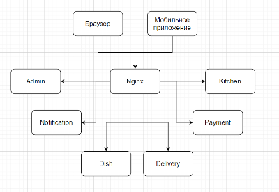

### job4j_fast_food

Проект сервиса доставки еды.

Приложение основано на микросервисной архитектуре и состоит из maven моделей.
Каждый модуль это отдельное Spring boot приложение.

#### Описание проекта:

- имеет каталог блюд

- может принимать заказы клиента на сайте. Либо через скачанное клиентами приложение

- предоставляет клиенту курьерскую доставку. Клиент может контролировать положение курьера

- предоставляет курьерам приложения, где они могут отчитываться о заказах, обновлять свое положение

- имеет админку в виде веб приложения, где можно оформлять поставки продуктов, а также видеть прибыль.

#### Структура проекта:

/admin/ - админка  
/dish/ - сервис блюд  
/order/ - сервис заказов  
/delivery/ - сервис доставки  
/kitchen/ - сервис кухни  
/payment/ - сервис платежей  
/notification/ - сервис уведомлений  
/domain/ - доменные модели  

#### В проекте используются такие технологии как:

1. Java 17
2. Spring boot 2.7.8
3. Apache Maven 3.8.5

#### Для сборки проекта понадобятся:

1. JDK 17
2. Maven 3.8.5

### Контакты для обратной связи:

mail: 101sergey101@gmail.com

telegram: [@bazarnov_sergey](https://t.me/bazarnov_sergey)

